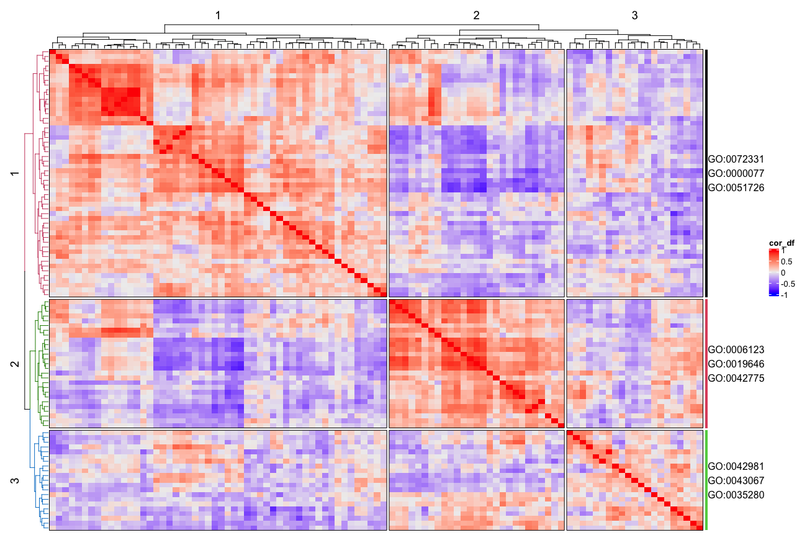

# **Goheatmap**
Heatmap with GO Terms

### Installation

The **development** version can be installed from GitHub using:

``` r
devtools::install_github("ilwookkim/GOheatmap")
```

### Usage

``` r
library(GOheatmap)
```

**Load example data**

``` r 
mat.file <- system.file("extdata", "countdata_examples.Rdata", package="GOheatmap")
load(mat.file)
```

**Pre-treatment**

Remove NAs. For the correlation coefficient matrix, remove values which has zero variance.

``` r

mat <- data.frame(na.omit(mat))
# Matrix transpose
mat <- data.frame(t(mat))
mat <- mat[, !sapply(mat, function(x) { sd(x) == 0} )]
cor_df <- cor(t(mat), method = "spearman")
                           
```

**Run goheatmap**

Parameters k (number of clustering), n_go (number of terms to display), sources (details here)[https://biit.cs.ut.ee/gprofiler/page/apis]
``` r
goheatmap(mat, k = 3, n_go = 3, sources = "GO:BP")

```


