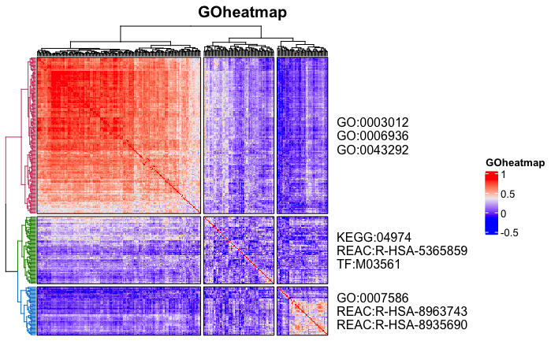
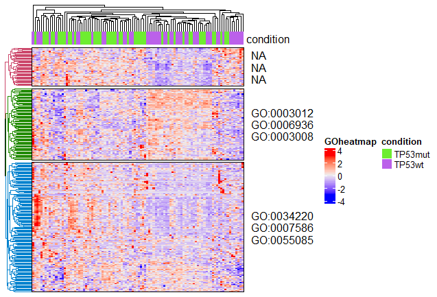

# **Goheatmap**
Heatmap with GO Terms

### Installation

The **development** version can be installed from GitHub using:

``` r
devtools::install_github("ilwookkim/GOheatmap")
```

### Usage

``` r
library(GOheatmap)
```

**Load example data**
selected STAD-TCGA RNAseq data (50 patients from TP53 wildtype and 50 from mutation; 275 genes selected by top significant DEGs) mat: RSEM countdata of RNAseq, samples_df: samples annotation data frame

``` r 
mat.file <- system.file("extdata", "mat.Rdata", package="GOheatmap")
load(mat.file)
ls()
```

``` r
[1] "mat"        "mat.file"   "samples_df"
```
**Pre-treatment**

Remove NA, if necessary.

``` r

mat <- data.frame(na.omit(mat))
knitr::kable(head(mat[, 1:4], 3), "simple")

# column: samples, row: genes (HGNC symbol)

         TCGA.CD.8536.01   TCGA.BR.8077.01   TCGA.HU.A4G3.01   TCGA.HU.A4H4.01
------  ----------------  ----------------  ----------------  ----------------
ACTC1                 31               104               349                37
ACTG2               4385              2080              6012              1236
ACTN2                  1                 6                 0                 1
```

**Run goheatmap**

goheatmap function needs following parameters. 
RNAseq countdata (column: samples ID, row: HGNC gene symbol), anno (samples annotation data frame, Default to <span style="color:grey">*NULL*</span>) ,Parameters k (number of clustering, Default to <span style="color:grey">*3*</span>), n_go (number of terms to display, Default to <span style="color:grey">*3*</span>), sources [details here](https://biit.cs.ut.ee/gprofiler/page/apis), cor (TRUE for spearman's correlation coefficient, FALSE for vst scaled matrix, Default to <span style="color:grey">*TRUE*</span>), title (Title of heatmap, Default to <span style="color:grey">*GOheatmap*</span>)


``` r
# For the spearman's correlation coefficient matrix

goheatmap(mat, k = 3, n_go = 3, sources = "GO:BP", cor.s = TRUE, title = "GOheatmap")
goheatmap(mat, k = 3, n_go = 3, sources = "KEGG", cor.s = TRUE, title = "GOheatmap")
```


When sources = "", goheatmap function uses all possible sources ("GO:MF","GO:CC","GO:BP","KEGG","REAC","WP","TF","MIRNA","HPA","CORUM","HP")

``` r
goheatmap(mat, k = 3, n_go = 3, sources = "", cor.s = TRUE, title = "GOheatmap")
```




When cor.s = FALSE, then countdata needs to be normalized for visualization.

``` r
# For the normalized count matrix by DESeq2

if (!requireNamespace("BiocManager", quietly = TRUE))
    install.packages("BiocManager")

BiocManager::install("DESeq2")

library(DESeq2)
dds <- DESeqDataSetFromMatrix(countData = mat,
                              colData = samples_df,
                              design = ~ condition)

dds <- DESeq(dds)
mat <- as.data.frame(counts(dds, normalized=T))
```
If samples annoation data frame is exist, provide it into anno parameter. Default to NULL

```r
knitr::kable(head(samples_df[, 1:2], 3), "simple")
```

```r
samples           condition 
----------------  ----------
TCGA.CD.8536.01   TP53wt    
TCGA.BR.8077.01   TP53mut   
TCGA.HU.A4G3.01   TP53wt    
```

```r
goheatmap(mat, anno = samples_df, k = 3, n_go = 3, sources = "GO:BP", cor.s = FALSE, title = "GOheatmap")
```


