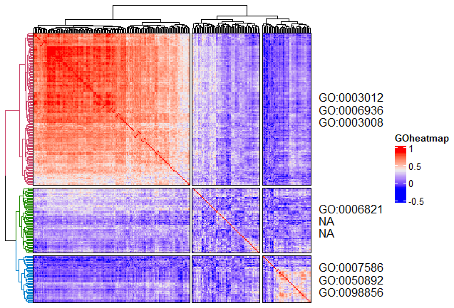

# **Goheatmap**
Heatmap with GO Terms

### Installation

The **development** version can be installed from GitHub using:

``` r
devtools::install_github("ilwookkim/GOheatmap")
```

### Usage

``` r
library(GOheatmap)
```

**Load example data**
selected STAD-TCGA RNAseq data (275 top significant DEGs; 50 patients from TP53 wildtype and 50 from mutation)
``` r 
mat.file <- system.file("extdata", "mat.Rdata", package="GOheatmap")
load(mat.file)
```

**Pre-treatment**

Remove NA, if necessary.

``` r

mat <- data.frame(na.omit(mat))
knitr::kable(head(mat[, 1:4], 3), "simple")

# column: samples, row: genes (HGNC symbol)

         TCGA.CD.8536.01   TCGA.BR.8077.01   TCGA.HU.A4G3.01   TCGA.HU.A4H4.01
------  ----------------  ----------------  ----------------  ----------------
ACTC1                 31               104               349                37
ACTG2               4385              2080              6012              1236
ACTN2                  1                 6                 0                 1
```

**Run goheatmap**

Parameters k (number of clustering), n_go (number of terms to display), sources [details here](https://biit.cs.ut.ee/gprofiler/page/apis), cor (TRUE for spearman's correlation coefficient, FALSE for z-score matrix from vst normalized count matrix), title (Title of heatmap)

``` r
# For the spearman's correlation coefficient matrix

goheatmap(mat, k = 3, n_go = 3, sources = "GO:BP", cor.s = TRUE, title = "GOheatmap")
goheatmap(mat, k = 3, n_go = 3, sources = "KEGG", cor.s = TRUE, title = "GOheatmap")

# For the normalized count matrix by DESeq2

if (!requireNamespace("BiocManager", quietly = TRUE))
    install.packages("BiocManager")

BiocManager::install("DESeq2")

library(DESeq2)
dds <- DESeqDataSetFromMatrix(countData = mat,
                              colData = samples_df,
                              design = ~ condition)

dds <- DESeq(dds)
mat <- as.data.frame(counts(dds, normalized=T))

goheatmap(mat, anno = samples_df, k = 3, n_go = 3, sources = "GO:BP", cor.s = FALSE, title = "GOheatmap")
```




