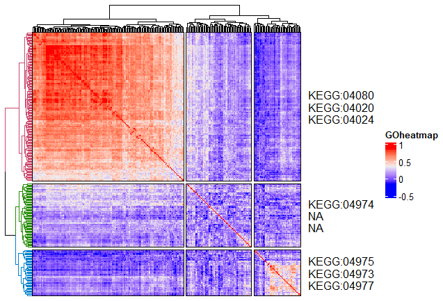

# **Goheatmap**
Heatmap with GO Terms

### Installation

The **development** version can be installed from GitHub using:

``` r
devtools::install_github("ilwookkim/GOheatmap")
```

### Usage

``` r
library(GOheatmap)
```

**Load example data**

``` r 
mat.file <- system.file("extdata", "mat.Rdata", package="GOheatmap")
load(mat.file)
```

**Pre-treatment**

Remove NA, if necessary.

``` r

mat <- data.frame(na.omit(mat))
knitr::kable(head(mat[, 1:4], 3), "simple")

# column: samples, row: genes (HGNC symbol)

        TCGA.AB.2803.03   TCGA.AB.2805.03   TCGA.AB.2806.03   TCGA.AB.2807.03
-----  ----------------  ----------------  ----------------  ----------------
AGO1          1758.2305         4728.2463         2947.8039         2831.1817
AGO2           367.2840          771.7537         1113.3036         1076.4647
AGO3           727.3663         1237.6171          896.2444          965.2433
```

**Run goheatmap**

Parameters k (number of clustering), n_go (number of terms to display), sources [details here](https://biit.cs.ut.ee/gprofiler/page/apis)

``` r
goheatmap(mat, k = 3, n_go = 3, sources = "GO:BP", cor = TRUE, title = "GOheatmap")
goheatmap(mat, k = 3, n_go = 3, sources = "KEGG", cor = TRUE, title = "GOheatmap")
goheatmap(mat, k = 3, n_go = 3, sources = "WP", cor = TRUE, title = "GOheatmap")

```




